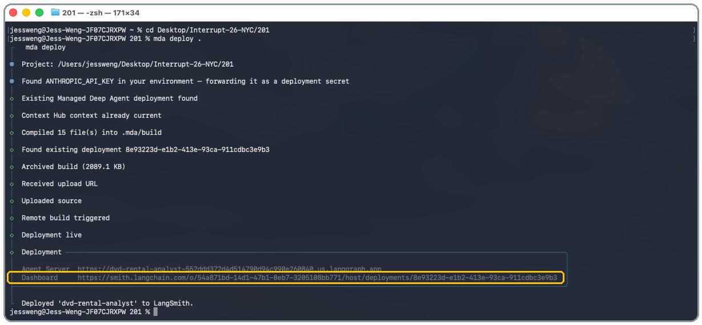

# Managed Deep Agents (MDA)

## Overview

A DVD-rental analyst agent built on
[`managed-deepagents`](https://github.com/langchain-ai/managed-deepagents-sdk) (MDA). Ask it a
business question and it writes and runs its own SQL and Python against `sakila.db`
(based on the sample Sakila dataset), inside a managed sandbox.

## What's in this repo

- `README.md`: the workshop walkthrough plus a reference appendix.
- `agent.py`: defines the agent, its model, and its tools. The `name` here is also the deploy id.
- `instructions.md`: the agent's system prompt, editable in Context Hub.
- `skills/`: task-specific playbooks the agent pulls in on demand, also editable in Context Hub.
- `sandbox/__init__.py`: declares the managed sandbox the agent runs code in.
- `sandbox/setup.sh`: one-time script that provisions that sandbox (loads the Sakila database, installs Python packages).
- `sakila.db`: the sample DVD-rental SQLite database the agent queries.
- `pyproject.toml`, `uv.lock`: project dependencies.
- `.env`: API keys (LangSmith and your model provider); never commit this.
- `artifacts/`: sandbox scratch output; gitignored.
- `images/`: screenshots used in this README.

## Steps

Work through these steps (in your own copy of this project). 

Everything below runs in a terminal, in this project's folder, unless it says otherwise.


## 1. Setup

Open a terminal in this project's folder (widen it) and run:

> *Widening it keeps the Dashboard URL from being split across two lines, which makes it
> easier to copy/paste.*

```
uv tool install managed-deepagents
```

Create a `.env` file in this project's folder (or use whatever opens a new file in your editor of choice):

```
code .env
```

Paste in:

```
LANGSMITH_API_KEY=
ANTHROPIC_API_KEY=
```

Fill in a [LangSmith](https://smith.langchain.com) API key (Settings → API Keys) 
and a key for whichever model provider you want to use. 

`agent.py` defaults to `anthropic:claude-sonnet-5`, so `ANTHROPIC_API_KEY` works as-is.

However using another provider (OpenAI, Google, etc.) is very simple! 
Just change the key name in `.env` and the `model=` line in `agent.py` to match.

```
mda deploy .
```

This builds and pushes the project to LangSmith. When it finishes (~5 mins), it prints an
Agent Server URL and a LangSmith dashboard URL.



1. **Copy and paste the dashboard URL**, it will open up in LangSmith Deployments.
2. Click on the blue **Connect** button in the top right corner.
3. Click the **Open in Studio** button to chat with your agent.


## 2. Try it out! Ask your agent questions

Type / paste these into LangSmith Studio, or write your own.
Here are some example questions to use:

1. What's our monthly revenue trend? Break it down as a table.
2. What are the top 5 film categories by number of rentals?
3. How does revenue compare between our two stores?

Ask any question and the agent writes + runs its own SQL (and Python, if the
question calls for further analysis) inside the sandbox → then answers with a short
written summary. 

- **Sandbox isolation:** the agent's code can't touch your machine, other threads' data, or
  anything outside its own scratch space.
- **Sandbox persistence:** follow-up questions in the same thread reuse earlier results
  instead of recomputing them, because MDA provisions one real sandbox per thread
  (`scope="thread"`) and reuses it. Self-hosted deepagents doesn't do this automatically.


## 3. Skim the wiring (read-only)

We've already written the instructions that tell this agent to run SQL and Python against
sakila.db. `sandbox/__init__.py` declares the sandbox it runs that code in (the following
code is the entire file):

```python
from managed_deepagents import define_sandbox

sandbox = define_sandbox(scope="thread")
```

One import, one function call.

<details>
<summary>If you were self-hosting this with open-source deepagents (instead of MDA):</summary>
<br>

This is what sandbox code looks like:

```python
from deepagents.backends import LangSmithSandbox  # or Modal/Runloop/Daytona
client = SandboxClient()
sandbox = client.create_sandbox(...)
agent = create_deep_agent(model=..., backend=sandbox)
```

That means standing up a sandbox provider, creating a client, creating a sandbox, and
passing it through to the agent yourself.

</details>


## 4. Edit instructions.md live

Open Context Hub and go to
`instructions.md`, this agent's system prompt: MDA hands this to the model on every turn,
so editing it changes how the agent behaves.

Add a persona to your agent:

```markdown
## Persona

Respond as a dramatic, woe-is-me Victorian-era child, mournful about every number you
uncover. Stay in character in every answer.
```

Save it in Context Hub.

> *To get back to Studio: click into **Deployments**, click **Connect**, then
> **Open in Studio**.*

Ask one of your earlier questions again in the same chat thread and compare.
`instructions.md` lives outside the deployed graph, in Context Hub, so a deployed agent
picks up an edit like this immediately, no redeploy needed.

> *Iterating on a self-hosted agent's behavior usually means changing code, redeploying,
> and restarting before you can test anything new.*

Try a few more personas (a pirate, a cowboy, an alien, etc.) and watch the tone change
each time, still with the same underlying SQL and Python running underneath.

The same mechanism works for real branding too, not just novelty personas: tone,
formality, terminology, whatever your company's voice calls for.


## 5. Skim the tools

Open `agent.py` and look at the `tools=[...]` list. It has one custom tool,
`email_report`, a plain Python function decorated with `@tool`. 

Ask your agent (in the same chat):

```
Email a summary of this month's revenue to finance@ourcompany.com.
```

Open the tool call in the trace and you'll see `email_report` fire with the recipient
and subject the model chose, plus the confirmation string it got back. This tool isn't
connected to an actual email service, but the tool call itself works the same way a
real one would.

Tools are the same for both open-source deep agents and MDA.

<details>
<summary>When would you split a tool into its own file?</summary>
<br>

`email_report` is a three-line helper, so it's defined right in `agent.py`. Once a tool needs
its own dependency or setup (e.g. an `internet_search` tool that wraps a Tavily client), it's
cleaner to give it a home in `tools/search.py` and import it into `agent.py`:

```python
# tools/search.py
from langchain.tools import tool
from tavily import TavilyClient

@tool
def internet_search(query: str, max_results: int = 5) -> str:
    """Search the web for a query."""
    client = TavilyClient()
    return client.search(query, max_results=max_results)
```

```python
# agent.py
from tools.search import internet_search

agent = define_deep_agent(..., tools=[email_report, internet_search])
```

</details>


## 6. Use a skill: generate a QBR report

Look at `skills/qbr-report/SKILL.md`. It's a folder of instructions for one specific
task, generating a Quarterly Business Review, that the agent pulls in only when it's
relevant, instead of always-on context like `instructions.md`. MDA mounts anything
under `skills/` read-only at `/skills/` and hands the agent the list automatically.

Ask your agent:

```
Generate a QBR report for the most recently completed quarter, broken down by
language, category, and top actors.
```

The skill tells the agent which quarter to use, which tables to join for each
breakdown (language, category, actor), and how to structure the write-up. Try asking
for a specific quarter instead (e.g. "Q1 2026") and compare the two reports.

A skill and `instructions.md` both live in Context Hub and both update without a
redeploy, but they're for different things: `instructions.md` shapes how the agent
behaves on every turn, a skill is a playbook the agent reaches for on demand.


## 7. Stretch questions

4. Which actors have appeared in the most films?
5. What's the average rental duration, by category?
6. Is there a relationship between a film's length and how often it gets rented?


## Go deeper

To learn more about deep agents, continue with the full **LangChain Academy Deep Agents course**.

---

<details>
<summary>

## Appendix (optional reference)

</summary>

### MDA components used in this workshop

| Component | What it does |
|---|---|
| `agent.py` | Defines the agent, its model, and its tools |
| `instructions.md` | The system prompt |
| `sandbox/__init__.py`, `sandbox/setup.sh` | Declares and provisions the sandbox |
| `sakila.db` | The sample database the agent queries |
| `pyproject.toml`, `uv.lock` | Project dependencies |
| `.env` | API keys |
| `artifacts/` | Sandbox scratch output |

### Typical MDA components (opt-in)

| Component | What it does |
|---|---|
| `identity.py` | Adds managed auth, see [Identity](#identity) |
| `memory.py` | Adds durable memory, see [Memory](#memory) |
| `tools/` | Organizes multiple or heavier tools as separate files, see [Optional runtime pieces](#optional-runtime-pieces) |
| `middleware/` | Custom middleware, see [Optional runtime pieces](#optional-runtime-pieces) |
| `skills/` | Skills synced to Context Hub, see [Optional runtime pieces](#optional-runtime-pieces) |
| `connectors/mcp.py` | Attaches MCP servers, see [Optional runtime pieces](#optional-runtime-pieces) |
| `evals/` | Harbor evals, see [Evals](#evals) |

### Identity

This project has no `identity.py`, so it runs with no managed auth. To require
callers to authenticate, add `identity.py` exporting an `identity = define_identity(auth=...)`
declaration (for example `auth.langsmith_api_key()`). That gives every caller private
threads and downstream credentials. See the
[identity docs](https://docs.langchain.com/langsmith/python/managed-deep-agents-identity)
for the available `auth.*` options.

### Memory

This project declares no memory, so nothing is kept between runs. Add `memory.py`
exporting `define_memory(scope="agent")` to give the agent a persistent directory at
`/memories/agent/`, shared across every thread for this deployment rather than reset per run.

### Optional runtime pieces

None of these are present in this project. Beyond `sandbox/`, an MDA project can also declare:

- `tools/`: a place to define tools as separate files instead of inline in `agent.py`, useful
  once you have more than a couple, or ones with heavier dependencies.
- `middleware/`: custom middleware.
- `skills/`: skills synced to Context Hub.
- `connectors/mcp.py`: attaches MCP servers; the file must export a named `connector` declaration.

---

### Sandbox setup script (`sandbox/setup.sh`)

MDA embeds `sandbox/setup.sh` and runs it once, the first time this project's sandbox is
provisioned.

```bash
pip install --quiet --break-system-packages pandas matplotlib
```
Installs the two libraries the agent's Python analysis relies on:

- `pandas` for querying and shaping data
- `matplotlib`, available for charting, though this project's `instructions.md` currently
  tells the agent to skip charts and images and stick to text

```bash
curl -s -o /tmp/sakila-schema.sql https://raw.githubusercontent.com/jOOQ/sakila/main/sqlite-sakila-db/sqlite-sakila-schema.sql
curl -s -o /tmp/sakila-data.sql https://raw.githubusercontent.com/jOOQ/sakila/main/sqlite-sakila-db/sqlite-sakila-insert-data.sql
sqlite3 sakila.db < /tmp/sakila-schema.sql
sqlite3 sakila.db < /tmp/sakila-data.sql
rm -f /tmp/sakila-schema.sql /tmp/sakila-data.sql
```
Downloads the Sakila sample database's schema and its data as two SQL files, loads both into
`sakila.db`, then deletes the downloaded files since they've already served their purpose.

```bash
mkdir -p artifacts
```
Creates the `artifacts/` directory the sandbox writes generated files to, so the very first
write doesn't fail on a missing folder.

### Deploy

Compile and deploy the project to LangSmith:

```bash
mda deploy .
```

This copies your files verbatim, generates a managed entry module, and writes a deployable
build (including `langgraph.json`) to `.mda/build`. The CLI uploads that build to LangSmith to
run your agent on the managed runtime.

Common options (each line below is a separate example, not meant to be combined):

```bash
mda deploy . --name dvd-rental-analyst-dev --deployment-type dev  # custom deploy name and type
mda deploy . --workspace-id "$LANGSMITH_WORKSPACE_ID"             # target a specific workspace
mda deploy . --no-wait                                            # return immediately, don't wait for the build
```

- Deploy prints both the Agent Server URL to call and the LangSmith dashboard URL to inspect.
- `mda deploy` loads `.env`, uses `LANGSMITH_API_KEY` for LangSmith, and forwards model provider
  keys such as `OPENAI_API_KEY` or `ANTHROPIC_API_KEY` as deployment secrets.
- Set `LANGSMITH_WORKSPACE_ID`, or pass `--workspace-id`, if your LangSmith API key requires a
  workspace selection.

### Logs

Read the deployed agent's server logs:

```bash
mda logs .
mda logs . --lines 200 --level error
```

In a terminal this streams new output until you press Ctrl-C. When the output is piped or
redirected, it prints the most recent lines (1000 by default) and exits.

### Delete

Remove the deployment and the LangSmith resources it created:

```bash
mda delete .
```

This deletes:

- The deployment
- The tracing project created alongside it
- The Context Hub repo holding this agent's context and memory
- The managed sandboxes this agent created

It asks first; pass `--yes` to skip the prompt. Agent memory and thread history are not
recoverable afterwards.

### Evals

Managed Deep Agent evals are Harbor evals. Author full Harbor tasks directly under
`evals/tasks/<task>/`. To start from a minimal task, run:

```bash
mda evals init my-task
```

This creates the optional scaffold `evals/scaffold/my-task/` with an `instruction.md` and a
language verifier. Run the same command with another name to add more scaffolds. At compile
time MDA copies selected scaffolds to `evals/tasks/` and preserves every other task. Compile
the managed agent, then run Harbor yourself:

```bash
mda evals compile .                 # all tasks
mda evals compile . --task my-task  # only my-task
# follow the printed `harbor run` command
```

</details>
